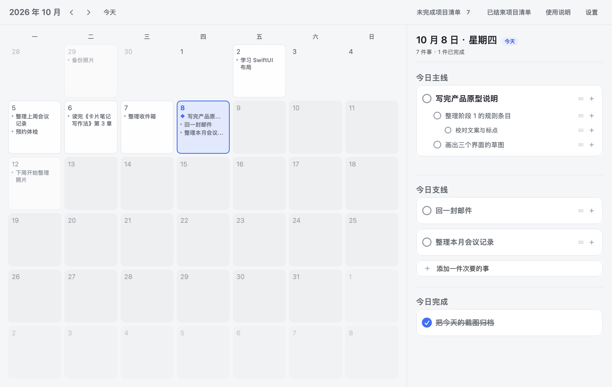
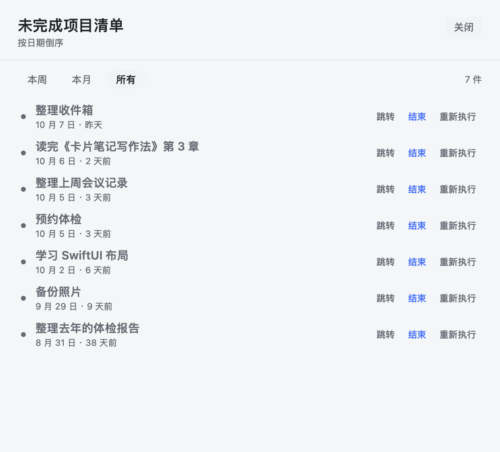
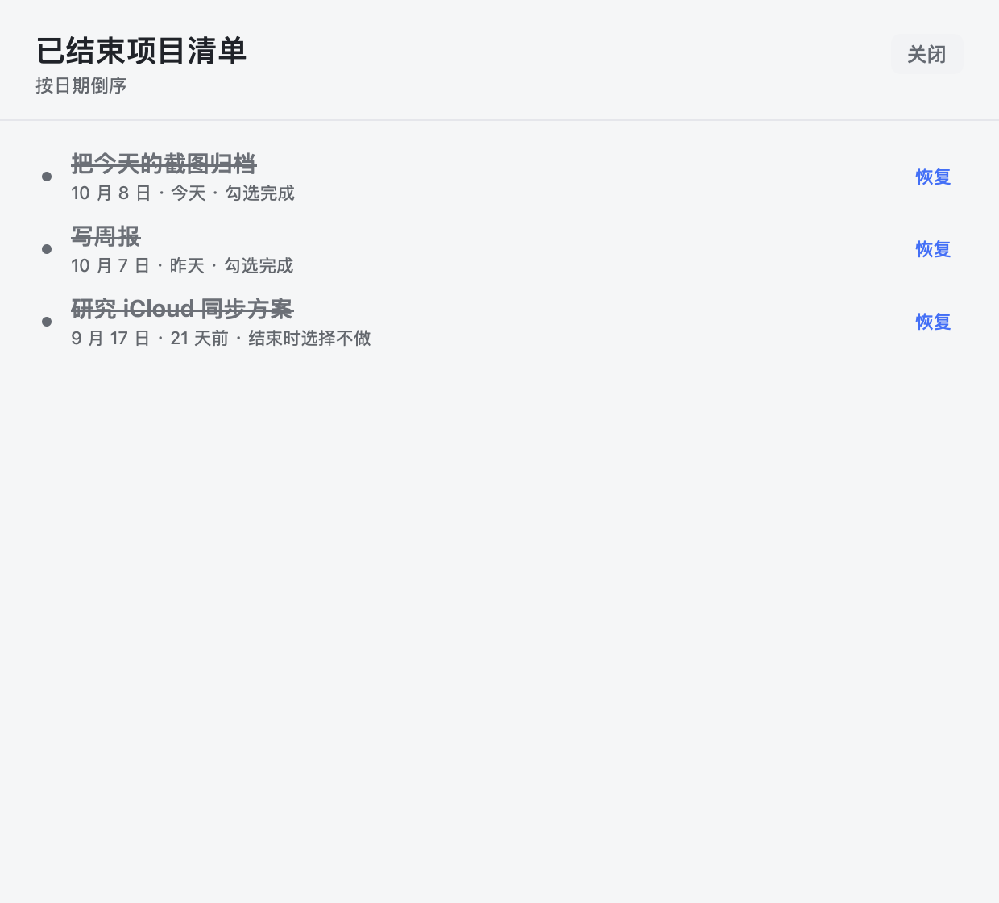
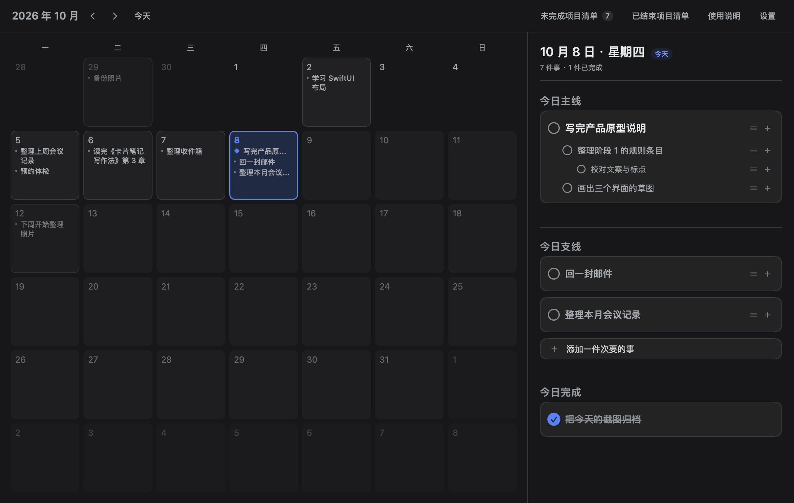
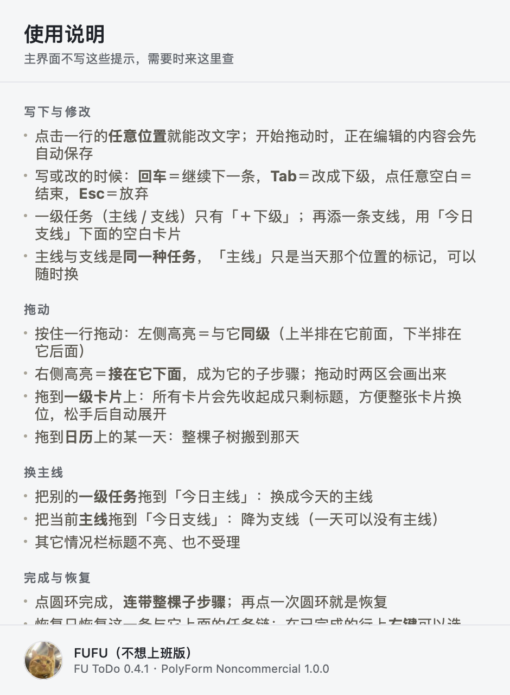

# FU ToDo

一个给低精力人群用的 Mac 每日计划应用：**一天一件最重要的事 + 若干支线**，写不下的自动进「未完成项目清单」，
每天自动开新的一天，不结转、不堆积。

灵感来自「活页本 + 便利贴」的纸质计划法，做成了原生 macOS 应用（SwiftUI，无第三方依赖）。



## 它长什么样

| 界面 | 说明 |
|---|---|
|  | 左边是月历，**一天一格、格子里就是那天的内容**；今天用品牌蓝描边，还没到的日子是浅灰 |
|  | 未完成项目清单：只列一级任务，可「跳转 / 结束 / 重新执行」 |
|  | 已结束项目清单：按日期倒序，随时「恢复」 |
|  | 深色模式 |
|  | 使用说明是独立窗口，附操作全表 |

## 设计要点

- **一天一件**：每天至多一条「主线」，其余都是「支线」；主线只是当天那个位置的标记，和支线是同一种任务
- **卡片式分组**：每个一级任务连同它的整棵子树是一张卡片，层级靠缩进和字号
- **拖动即整理**：行内左半边＝同级（上/下决定前后）、右半边＝衔接（成为子步骤）；拖动整张卡片时所有卡片会收起成标题列表
- **不惩罚没做完**：跨天自动开新的一天，旧任务进未完成清单，随时「重新执行」搬回今天
- **界面克制**：主界面不写说明性文案、不堆统计；配色与字号有单一来源的规范（见 `docs/`）

## 构建与运行

需要 macOS 14+ 与 Swift 6 工具链（命令行工具即可，不需要 Xcode）。

```bash
cd app
./build.sh          # 编译 + 自测 + 组装 dist/FU ToDo.app
./build.sh run      # 编译并启动
./build.sh dmg      # 生成 dist/FU ToDo.dmg 安装包
```

> 注意：`swift build` 在本机需要用 `--disable-sandbox`（构建脚本已处理）；`hdiutil` 建 dmg 需要在普通终端执行。

## 文档

按产品流程逐阶段产出，都在 `docs/`：

- `01-业务流程图/`：业务流程图、状态机图（可交互 HTML）+ 业务规则说明（规则的单一来源）
- `02-产品结构图/`：产品结构图 + 结构说明（含字号表、配色对比度底线、界面克制度）
- `03-产品原型/`：早期原型（已被阶段 4 的实现取代，留作记录）

## 许可证

[MIT](LICENSE) © FUFU

## 版本

版本号单一来源：`app/Sources/Core/AppVersion.swift`。当前 **0.1**。
